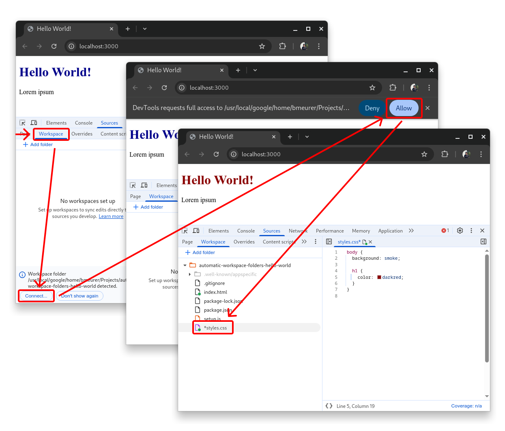

# Hello World demo for Automatic Workspace Folders

This is a trivial Hello World demo for the new [Automatic Workspace Folders][documentation]
feature in Chrome DevTools and later. Checkout the [documentation] on how to set up Google
Chrome (Canary) to enable the feature. Follow the steps below to try it out.

## Installation

Checkout and setup the demo via:

```
git clone http://github.com/bmeurer/devtools-automatic-workspace-folders-hello-world.git
cd devtools-automatic-workspace-folders-hello-world
npm install
```

Afterwards open [http://localhost:3000](http://localhost:3000) in your Google Chrome (Canary),
open DevTools, and reveal the Workspace tab in the Sources panel. If you set up everything
correctly, you'll see an infobar at the bottom offering you the option to connect the folder
to the workspace.



Once you've clicked `Connect...`, Chrome will ask you to allow full access to the folder via
a browser permission prompt. You need to click `Allow` here.

If everything went well, you'll now be able to use the project folder as part of your Workspace
and edit files from your project directly within DevTools, and also persist changes that you
made during debugging to your project source.

[documentation]: http://goo.gle/devtools-automatic-workspace-folders
